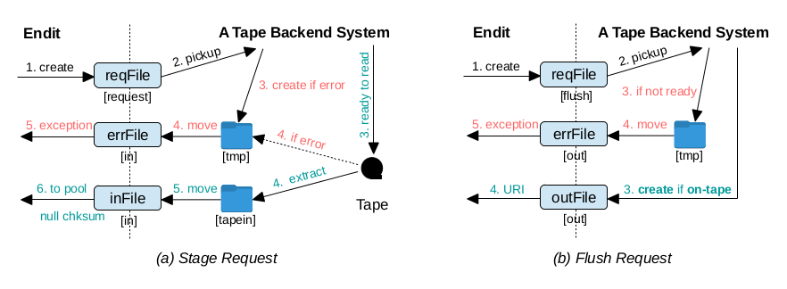

An Example Adaptation of dCache Endit Provider
==============================================

This is an example adaptation of the original [dcache-endit-provider] for a tape backend system. It is duplicated from the original [dcache-endit-provider] due to no intention of being merged to the original project due to some differences in workflow.

The following diagram shows how this plugin interacts with the tape backend system

As shown in the above diagram, the tape backend system has a different workflow from [Endit] for flush requests.  It writes and reads files in groups so, unlike [Endit], it requires at least two flush requests; the first is to register the request and it fails always, and the second is to check the status.  On the second request, it returns on-tape message to this plugin if the file has been written to tape. Thus a main difference of this adapation from the original [dcache-endit-provider] is the FlushTask class, which is modified to fit the workflow.

There are some other changes from the original including the followings

* using intermediate directories to hold intermediated files until they are completed
  - this is to avoid too many MODIFY events and to ensure completeness of the files when they appear in the watch directories
  - these directories are used soley by the tape backend system and thus are isolated from this plugin
  - this trick can be dropped if there is a library supporting IN_CLOSE_WRITE event
* watch list and event types to exploit the above change
  - error files will be created to inDir/outDir so requestDir is dropped from the watch directories list
  - only ENTRY_CREATE event is being watched
* excessive log messages to monitor tasks' progress
  - log level is set to higher than 'info' to avoid logs from other parts of dcache

See [original README.md](README-original.md) for more information and instructions.

[dcache-endit-provider]: https://github.com/neicnordic/dcache-endit-provider
[Endit]: https://github.com/neicnordic/endit
